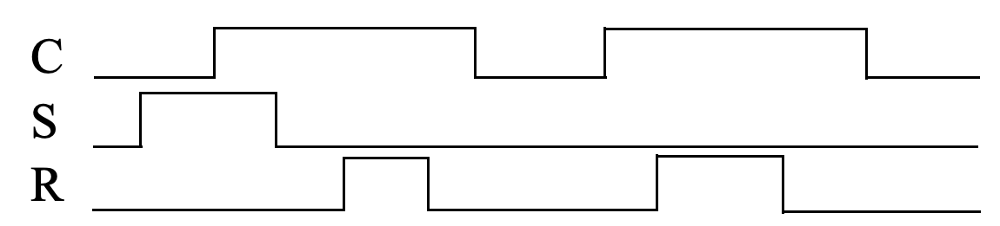
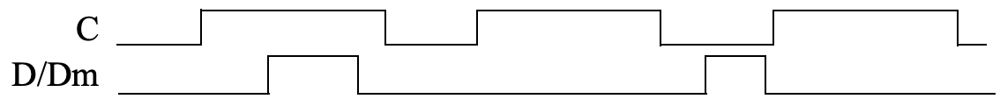

In the report, complete the following.
- Explain the objective of the problem.
- Give your solution.
- Include all your project codes in the [codes/assg](../../codes/assg) folder,
  if required.
- Explain your code snippets, if required.
- Include screenshots of the simulations in this folder, and insert them into
  the markdown file, if required.
- Explain why the simulations are correct, if required.

## (5 pts)
 Trace the behavior of an SR latch for the following situation: Q, S, and R have been 0 for a long time, then S changes to 1 and stays 1 for a long time, then S changes back to 0. Using a timing diagram, show the values that appear on wires S, R, t, and Q. Assume logic gates have a tiny nonzero delay..

## (5 pts)
Repeat the problem above, but assume that S was changed to 1 just long enough for the signal to propagate through one logic gate, after which S was changed back to 0 -- in other words, S did not satisfy the hold time of the latch.

## (5 pts)
Trace the behavior of a level-sensitive SR latch for the input pattern in Figure below. Assume S1, R1, and Q are initially 0. Complete the timing diagram, assuming logic gates have a tiny but non-zero delay.

## (5 pts)
Trace the behavior of a D latch for the input pattern in Figure below. Assume Q is initially 0. Complete the timing diagram, assuming logic gates have a tiny but non-zero delay. 

## (5 pts)
Trace the behavior of an edge-triggered D flip-flop using a master-servant design for the input pattern in Figure below. Assume each internal latch initially stores a 0. Complete the timing diagram, assuming logic gates have a tiny but non-zero delay. 

## (5 pts)
Using four registers, design a circuit that stores the four values present at an 8-bit input D during the previous four clock cycles. The circuit should have a single 8-bit output that can be configured using two inputs s1 and s0 to output any one of the four registers. (Hint: use an 8-bit 4x1 mux. Be careful with the blocking and nonblocking statement in Verilog.)

## (5 pts)
Implement the previous design in Verilog. Verify the design with a testbench with four sequences of input D. One for each selection setting for the mux.
